# Application Security Assessment of DVWS-Node
### A Software Composition, Static, and Dynamic Analysis Study with CI/CD Integration

**Final Project Report - Module: Component Security**

| | |
|---|---|
| **Submitted by** |Athul Thuvattu Paramabth|
| **Student ID**  |35250310|
| **Programme** |Master's in Cybersecurity|
| **Professor** |Danijela Boberić Krstićev|
| **Date of Submission**|11/08/2026| 

---

## Abstract 

This report presents an application security assessment of DVWS-Node (Damn Vulnerable Web Services, Node.js edition), an intentionally vulnerable application used for security education. The assessment combines four complementary techniques: Software Bill of Materials (SBOM) generation, Software Composition Analysis (SCA), Static Application Security Testing (SAST), and Dynamic Application Security Testing (DAST), integrated with an automated Continuous Integration/Continuous Deployment (CI/CD) security pipeline implemented in GitHub Actions.
An SBOM comprising 530 software components was generated using Syft and analysed through OWASP Dependency-Track, which identified 63 known vulnerabilities (15 Critical, 36 High, 8 Medium, 4 Low) and computed an aggregate project risk score of 358. Static analysis using the Snyk CLI examined 507 dependencies and reported 121 distinct issues across 207 vulnerable code paths. Manual dynamic testing, performed with Zaproxy, Burpsuite and Diresearch, confirmed seven exploitable vulnerabilities in the running application, including a Critical-severity XML External Entity (XXE) injection and directly demonstrated Path Traversal vulnerability.
The findings were consolidated into a prioritized mitigation strategy, and a CI/CD pipeline was implemented that automatically generated an SBOM, executes SCA and SAST scans on every push and pull request, and enforces a security policy that fails the build when a Critical-severity finding (CVSS >= 9.0)  is detected. The results demonstrated that combining automated component analysis with manual dynamic testing yields a more complete risk picture than any single technique in isolation, and that the most severe finding (XXE injection) was independently corroborated by both static and dynamic methods.

## Table of Conetents

1. [Introduction](#1-introduction)
2. [Methodology](#2-methodology)
3. [SBOM Analysis](#3-sbom-analysis)
4. [Dependency Vulnerability Analysis (SCA)](#4-dependency-vulnerability-analysis-sca)
5. [Static Analysis Results (SAST)](#5-static-analysis-results-sast)
6. [Dynamic Analysis Results (DAST)](#6-dynamic-analysis-results-dast)
7. [Automation with GitHub Actions](#7-automation-with-github-actions)
8. [Mitigation Strategy](#8-mitigation-strategy)
9. [Conclusion](#9-conclusion)
10. [Reference](#10-reference)

---

## 1. Introduction

### 1.1 Background Description

Modern web application are assembled from a large proportion of third-party code: open-source libraries, frameworks, and transitive dependencies frequently constitute the majority of an application’s attack surface. Consequently, application security assessment can no longer rely solely on reviewing first-party source code, it must also account for the provenance and vulnerability status of every included component. This has motivated the growing adoption of Software Bills of Materials (SBOMs) and Software Composition Analysis (SCA) as complements to traditional Static (SAST) and Dynamic Application Security Testing (DAST).

### 1.2 Application Description

DVWS-Node (Damn Vulnerable Web Services – Node.js),  is an intentionally vulnerable web application built for security training. It exposes a set of deliberately insecure services – a REST/HTTP API, a GraphQL endpoint, and an XML-RPC endpoint, that reproduces common OWASP Top 10 and API security weaknesses (injection, broken access control, XXE, XSS, and insecure file handling) in a safe, self-contained lab environment.

This assessment treats DVWS-Node as the target application and combines automated software composition analysis (SCA), static analysis (SAST), and manual dynamic testing (DAST) with an automated CI/CD security pipeline, following the assignment’s required report structure.

### 1.3 Technology Stack

| Layer | Technology |
|---|---|
| Runtime | Node.js |
| Web framework | Express.js |
| API layer | Apollo GraphQL |
| RPC layer | XML-RPC (node-xmlrpc / xmldom) |
| Database | MongoDB (Mongoose, mongodb driver) |
| Dependency Count | 530 components |

## 2. Methodology

A mix of two method approach was adopted, combining automated component-level analysis with manual exploitation, in line with recommended practice for holistic application security assessment. All testing was conducted against a local instance of DVWS-Node running on Kali Linux, in an isolated lab environment with no external network exposure.

| Stage | Tool | Purpose |
|---|---|---|
| SBOM generation | Syft (Anchore) | Enumerate all first and third-party components into a CycloneDX SBOM |
| SCA | Snyk CLI | Statically identify known-vulnerable dependency code paths |
| DAST | Burp Suite Community Edition, diesearch, Zaproxy | Manually probe the running application for exploitable vulnerabilities |
| CI/CD automation | GitHub Actions | Automate SBOM/SCA/SAST execution |

Vulnerability severity is reported throughout this document using the Common Vulnerability Scoring Systems version 3.1 (CVSS v3.1), as computed by the respective tool (Dependency-Track for SCA findings, Snyk for SAST findings). DAST findings identified through manual testing were scored by the assessor using the same CVSS v3.1 framework for consistency.

---

## 3. SBOM Analysis

### 3.1 Tool Used

Syft (Anchore) was used to generate a Software Bill oF Materials for the DVWS-Node source tree, exported in CycloneDX JSON format (bom.json) and re-imported into OWASP Depenedecy-Track for tracking, vulnerability correlation, and risk scoring.

### 3.2 Summary Statistics

| Metric | Value |
|---|---|
| Total components in SBOM | 530 |
| SBOM format | CycloneDX JSON |
| Ecosystem | npm (JavaScript / Node.js) packages |
| Analysis platform | OWASP Dependency-Track |

The SBOM was the foundation for the rest of the assessment: it was fed into Dependency-Track for continuous SCA, and its component/version list was cross-referenced against the Snyk SAST findings.

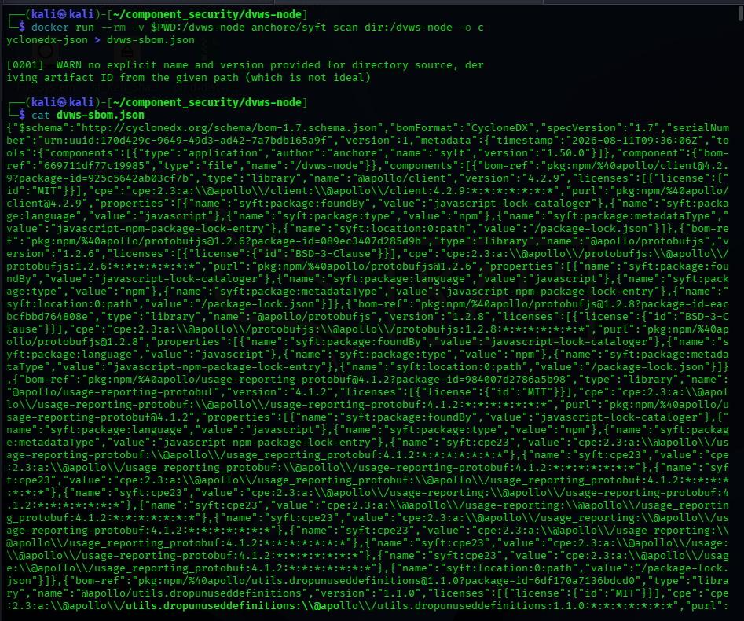*Figure 1. Syft SBOM generation via Docker*

---

 ### 4. Dependency Vulnerability Analysis (SCA)

The SBOM (530 components) was analyzed in OWASP Dependency-Track, which correlates each component against the NVD and other vulnerability sources and computes a project risk score.

### 4.1 Summary

| Metric | Value |
|---|---|
| Total dependencies (components) | 50 |
| Vulnerable dependencies| 63 vulnerabilities, across 15+ distinct components |
| Critical | 15 |
| High | 36 |
| Medium | 8 |
| Low | 4 |
| Project Risk Score (Dependency-Track) | 358 |

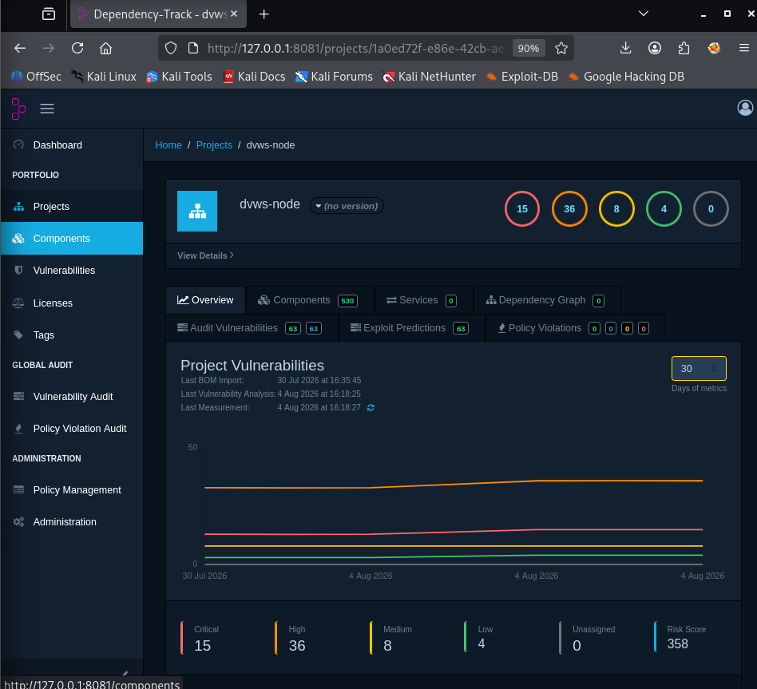 *Figure 2. Dependency-Track Dashboard*

### 4.2 Highest-Risk Components

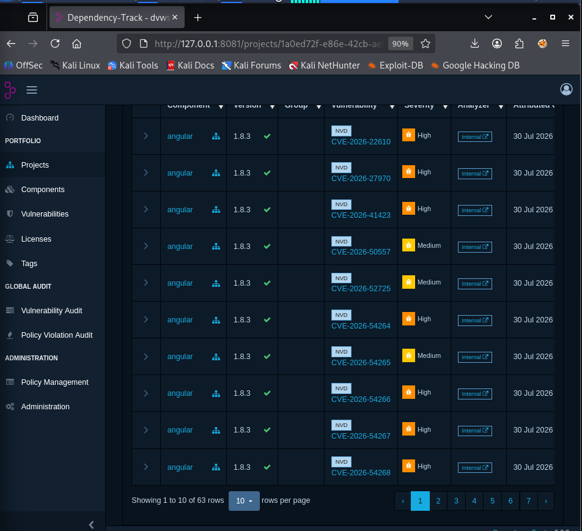 *Figure 3. Ten Components with the highest Dependency-Track risk score*

vm2 (a sandbox/VM library, risk score 146) and angular 1.8.3 (a legacy front-end dependency, risk score 80) dominate the risk profile – together they account for roughly 63% of the project’s total risk score. Vm2 in particular is notable because its historical CVEs are sandbox-escape vulnerabilities, which can translate to remote code execution if the sandboxed code path is reachable from user input.

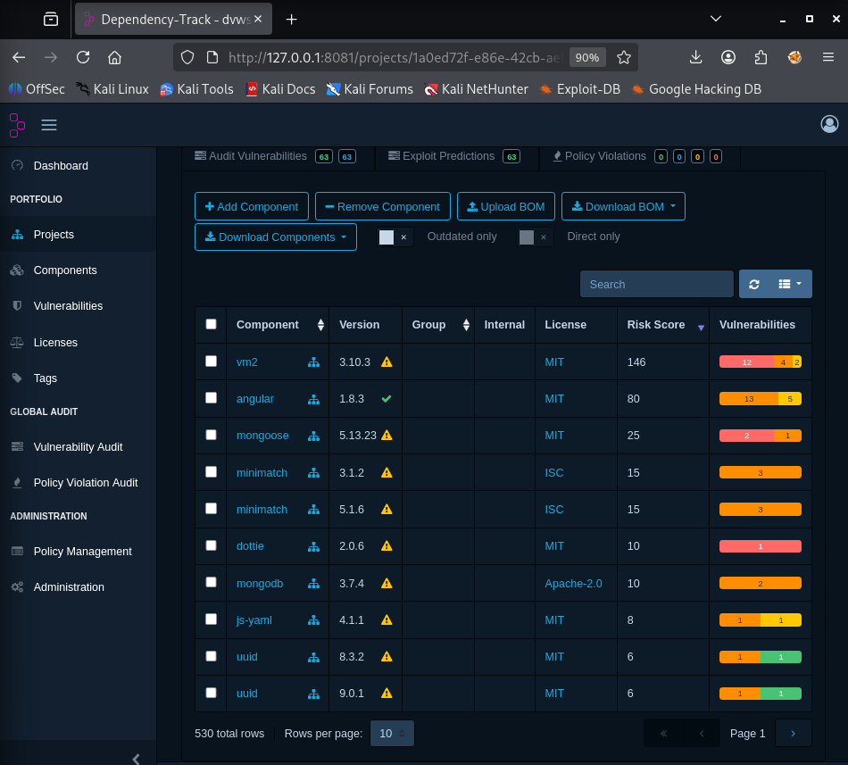 *Figure 4. Vulnerability list showing CVE entries*

---

## 5. Static Analysis Results (SAST)

### 5.1 Tool Used

The Snyk CLI (snyk test) was used to statically analyses the DVWS-Node dependency tree and identify known-vulnerable code paths introduced through third-party packages.

### 5.2 Summary

| Metric | Value |
|---|---|
| Dependencies tested | 507 |
| Total issues found | 121 |
| Vulnerable paths | 207 |
| Critical | 24 |
| High | 46 |
| Medium | 49 |
| Low | 3 |

### 5.3 Analysis of Findings

The three most significant issue clusters are analysed below

*@xmldom/xmldom@0.8.11*: Snyk identified ffour high-severity XML Injection vulnerabilities and one uncontrolled recursion vulnarbility in this package. The package is used as the XML parser for both the SOAP and XML-RPC services. Dynamic testing also confirmed an active XML External Entity (XXE) vulnerability in the SOAP service. Therefore, these Snyk findings are supported by practical testing and indicate a genuine security risk rather than only a theoretical weakness. Snyk recommends upgrading the package to @xmldom/xmldom@0.8.13.

*tar@6.2.1*: Several medium-severity vulnerabilities were identified in the tar package, including directory traversal, incorrect Unicode handling, interpretation conflicts, incorrect type conversion, and uncontrolled recursions. Snyk also recommended because this upgrade resolves the related vulnerabilities.  

*brace-expansion@1.1.12*: This package contains a high-severity Regular Expression Denial-of-Service (ReDoS) vulnerability. It is introduced through the dependency chain swagger-autogen@22.23.7 -> glob@7.2.3 -> inflight@1.0.6. Because these packages support API documentation generation and are not part of the main runtime request-processing path, the vulnerability is primarily associated with the build and development environment.

Overall, Snyk tested 507 dependencies and identified 121 ssues across 207 vulnerable dependency paths. Most of these issues originated from third-party packages rather than from the application's own source code. This finding is consistent with the Software Composition Analysis results discussed and shows that improving dependency management is the most important step for reducing the static security risk of DVWS-Node.

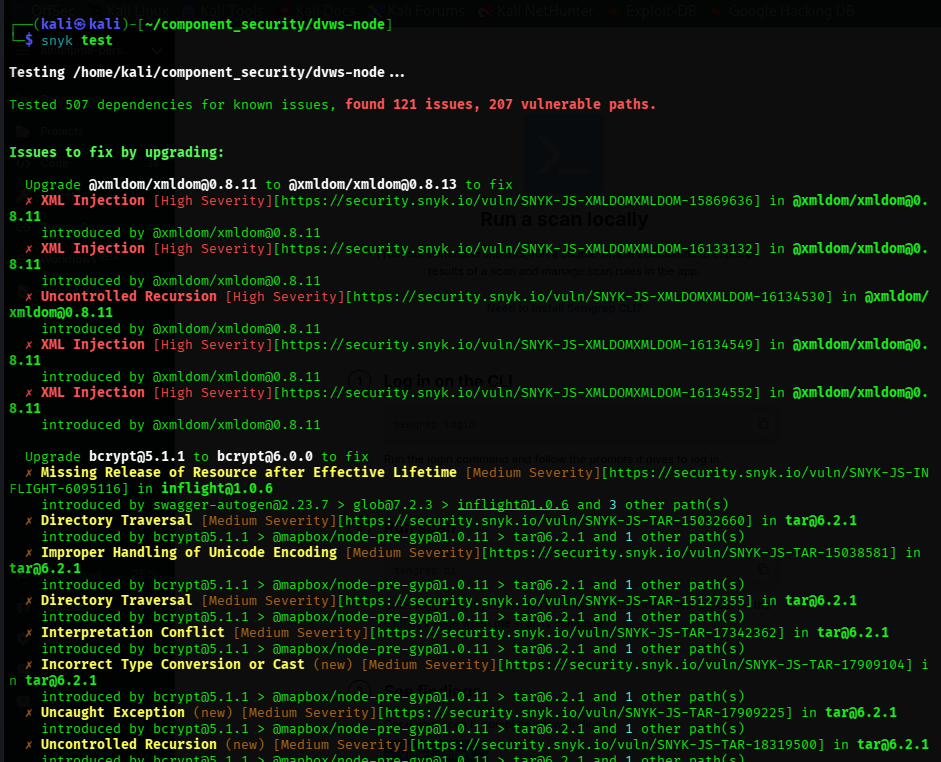*Figure 5. Snyk CLI terminal output confirming 507 dependencies tested, 121 issues across 207 vulnerable paths, and listing the xmldom and tar issue clusters discussed above.*

### 5.4 Static and Composition Anlaysis : Semgrep Appsec Platform

The DVWS-Node repository was also scanned using the Semgrep AppSec Platform, which provides the first-party static code scanning and dependency scanning with reachability analysis ("Supply Chain"). Two full scans were run against the 'master' branch, each completing in under four minutes and reporting 170 total findings (47 code, 0 secrets, 123 Supply Chain).

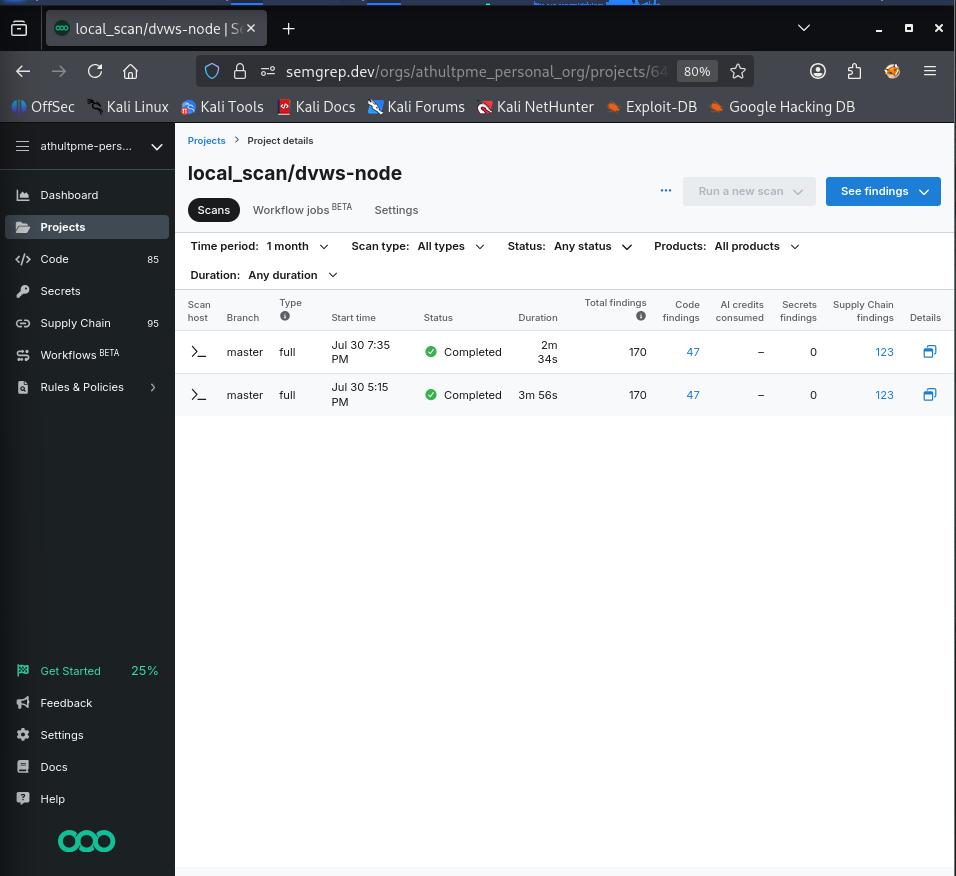 *Figure 6. Semgrep scan for the 'local-scan/dvws-node'*

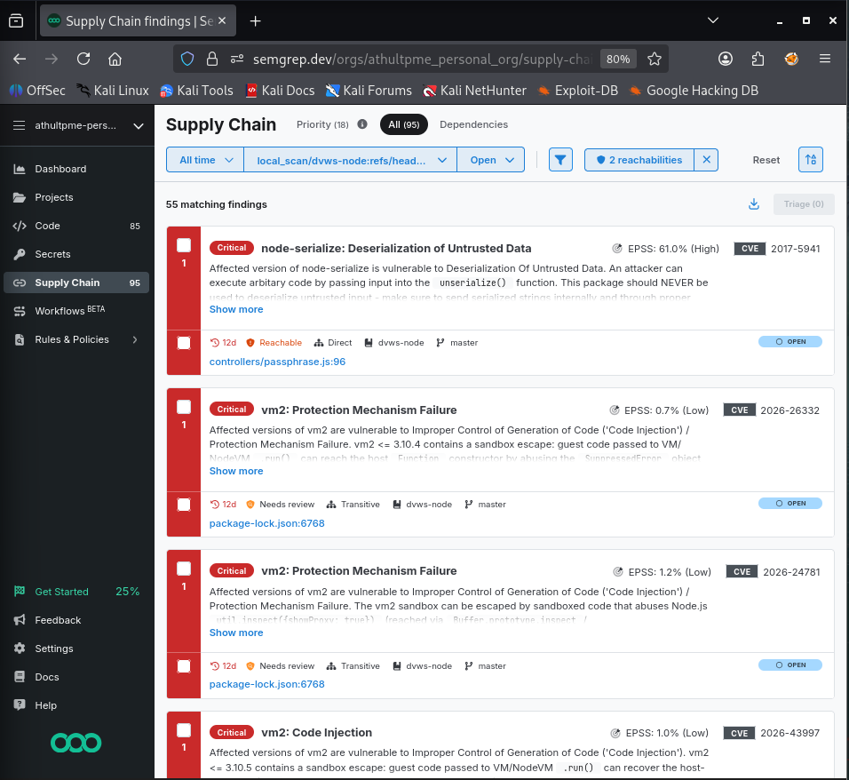 *Figure 7. Semgrep Supply Chain findings*

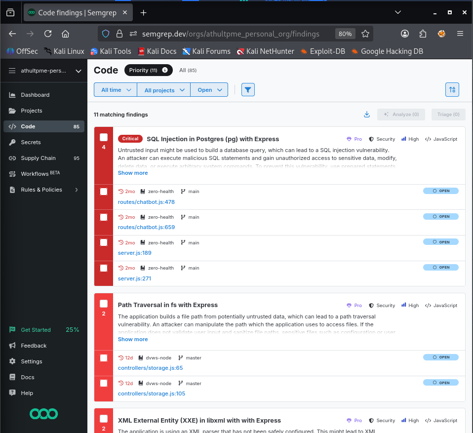*Figure 8. Semgrep Code finding*

---

## 6. Dynamic Analysis Results (DAST)

### 6.1 Tools Used

Manual dynamic testing was conducted using Burp Suite Community Edition for request interception, tampering, and evidence capture via the Repeater tool, and dirsearch for endpoint/content discovery, sup[lamented by manual testing using a standard web browser against the running DVWS-Node instance.

### 6.2 Test Accounts

Two separate, self-registered DVWS-Node accounts were used across testing, in two different browsers, to all cross-account behaviour (such as the data leakage described ) to be observed directly rather than inferred.

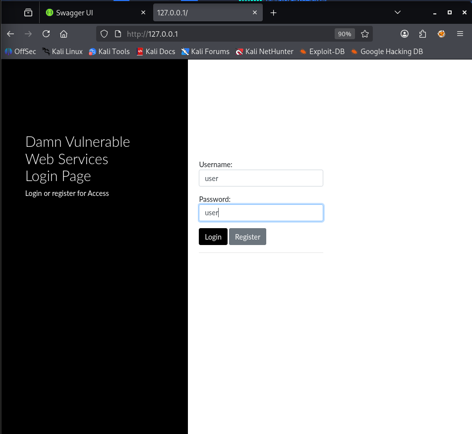*Figure 9. DVWS-Node Login page*

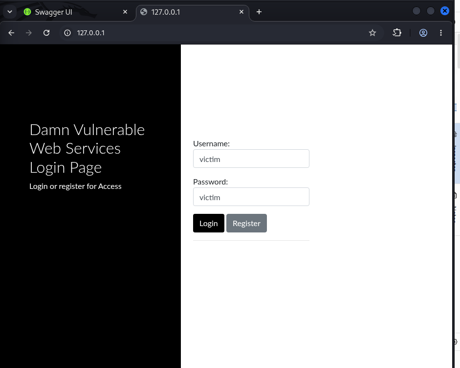*Figure 10. DVWS-Node login page, authenticating as the test account*

### 6.3 Reconnaissance

Prior to exploitation, dirsearch was used to enumerate reachable static content and endpoint on the target, informing the selection of attack surfaces for subsequent manual testing.

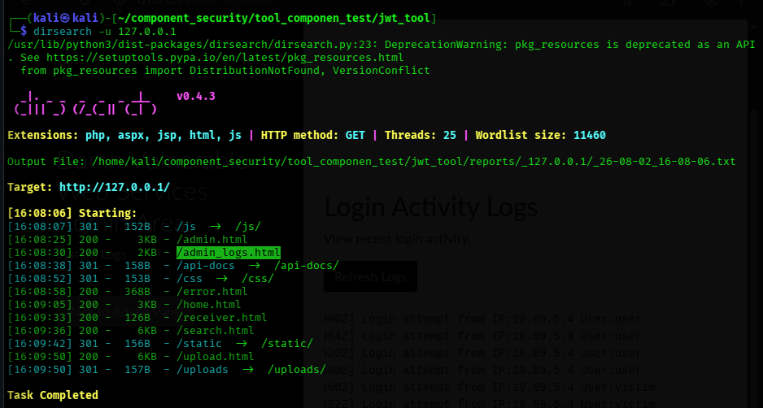*Figure 11. Dirsearch Scan against DVWS-Node target*

Several of the paths identified here - notably /upload.html and /search.html , correspond directly to the Path Traversal and NoSQL Injection findings reported below.

### 6.4 Findings

| Vulnerability | Endpoint | CVSS | Authentication |
|---|---|---|---|
| XXE Injection | SOAP Username Service ('soapserver.js') | 9.8 (Critical) | Authenticated session |
| Path Traversal | Upload/Download handler, 'filename' parameter | 7.2 (High)| Authenticated session |
| Stored XSS | Upload file served back verbatim ('/uploads/..')| 7.5 (High) | Authenticated (upload step) |
| Reflected XSS | Login form, username field | 7.1 (High) | Unauthenticated |
| NoSQL Injection | 'POST /search.html' ('search' parameter) | 6.5 (Medium) | Authenticated session |
| Information Disclosure | 'GET /api/v1/info' | 5.3 (Medium) | Unauthenticated |
| GraphQL Introspection*| GraphQL endpoint | 5.3 (Medium, estimated) | Unauthenticated |

#### 6.4.1 XXE Injection (Critical)

A crafted SOAP request was submitted to the Username Service exposed by 'soapserver.js', containing a DOCTYPE declaration with an external entity referencing the local 'file:///etc/passwd', the SOAP response returns the contents of the host's password file.*

This is assessed as the most severe DAST finding: an authenticated user can read arbitrary files readable by the Node.js process, and - depending on the xmldom configuration - XXE of this form can frequently be escalated toward Server-Side Request Forgery or, in some parser configurations, remote code execution.

#### 6.4.2 Path Traversal (High)

The file-download feature accept a 'filename' parameter that is concatenated into a filesystem path without sanitisation. Supplying a relative-path payload of '../../../etc/passwd', within an authenticated session (a valid 'auth_token' cookie), returned the contents of '/etc/passwd'.

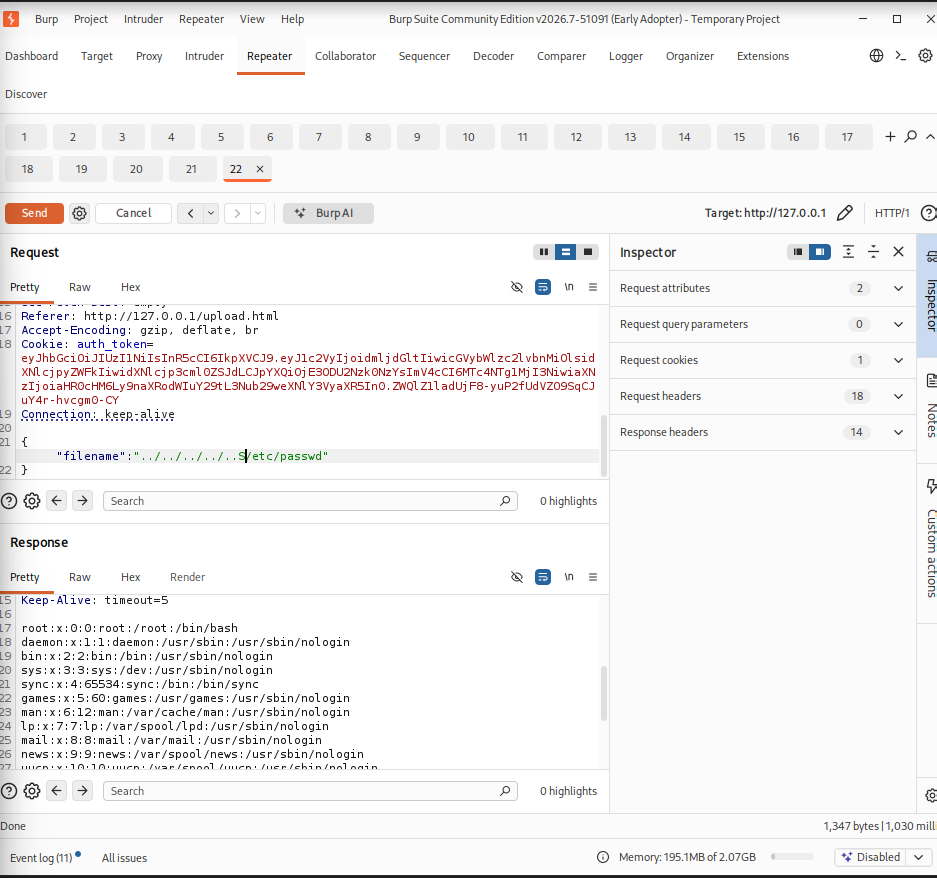 *Figure 12. Path Traversal via Burp Repeater*

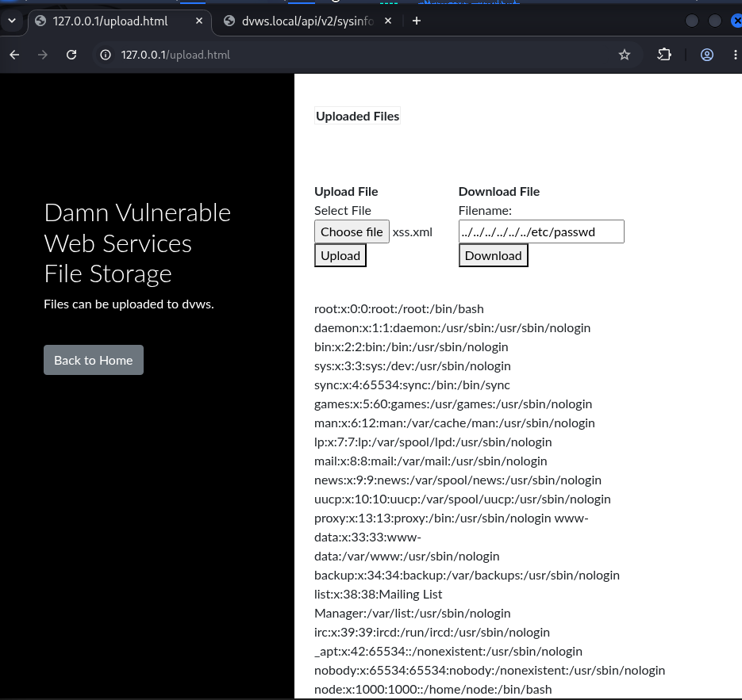 *Figure 13. The same vulnerability reproduced directly in the browser*

#### 6.4.3 Stored Cross-Site Scripting (High)

The file-upload feature accepts arbitrary file content, including an XML file ('xss.xml') containing an embedded script payload. When the uploaded file was subsequently requested directly at 'uploads/user/xss.xml', the browser executed the embedded script, demon strating that uploaded content is served back without content-type enforcement or sanitisation.

#### 6.4.4 Reflected Cross-Site Scripting (High)

The login form's username field reflects user input without encoding. Submitting '' as the username caused immediate execution of the injectsd script, prior to authentication.

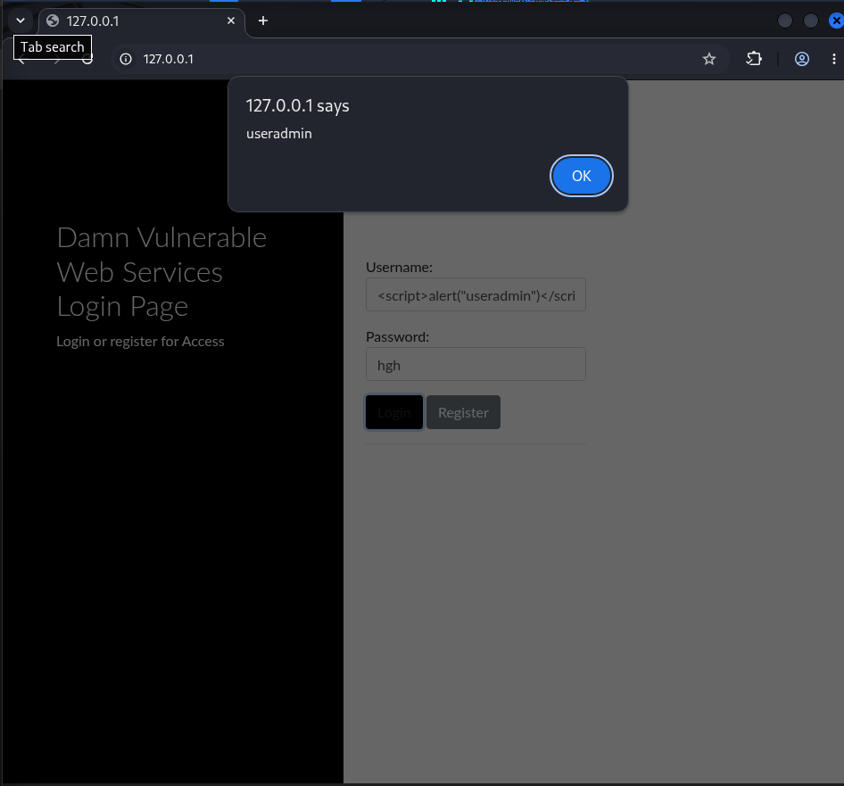*Figure 14. Reflected XSS: a script payload in the login username field*

#### 6.4.5 NoSQL Injection (Medium)

The search feature ('POST /search.html') passes the 'search' parameter directly into a MongoDB query without validation. Submitting the payload 'www' || '1'=='1'' as the search term bypasses the query filter, returning other users' records, including a document with a "secret" field.*

This finding has a secondary broken-access-control dimension: beyond confirming injection, the returned response demonstrates that the query logic does not scope results to the requesting user, so the injection directly enabled unauthorised access to other users' private data. The shape of the payload (a javaScript-style Boolean expression rather than a MongoDB operator such as '$ne') is also consistent with server-side evaluation of user input - a pattern worth investigating against the 'vm2' sandboxing dependency flagged as the highest-risk SCA finding, though confirming that relationship directly would require source-code review, which was outside the scope of this assessment. 

#### 6.4.6 Information Disclosure (Medium)

The endpoint 'GET /api/v1/info' returns detailed environment information with no authentication required, including the internal MongoDB connection string ('mongo://dvws-mongo:27017/node-dvws'), the container hostname, and Node.js/npm/Yarn version metadata.

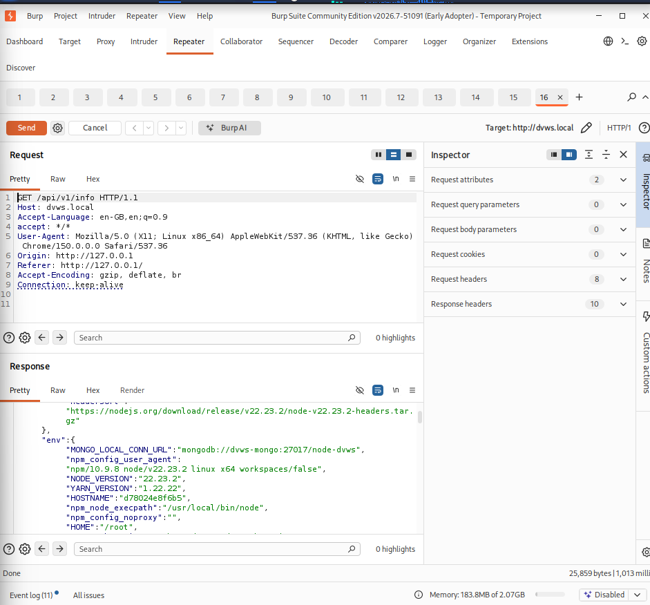*Figure 15
. Unauthenticated information disclosure via 'GET /api/v1/info', exposing the internal MongoDB connection string and environment metadata.*

While this endpoint does not directly expose credentials, the disclosed internal hostname and connection topology reduce the reconnaissance effort required for a subsequent, more targeted attack, and should be treated as a genuine information-disclosure weakness rather than a purely cosmetic issue.

#### 6.4.7 GraphQL Introspection (Reported, Not Re-Verified)

GraphQL introspection was recorder as enable against the Apollo GraphQL endpoint in earlier project testing notes. No corresponding request capture was available at the time of writing this iteration of the report, and the finding was therefore not independently re-verified through Burp Suite in the same manner as the six findings above. It is retained and in the mitigation register for completeness and traceability, but in explicitly distinguished from the evidence findings, and should be retested and capture before being relied upon in any subsequent submission or remediation sign-off.

### 6.5 Analysis if Findings

The XXE finding is assessed as the most severe of the confirmed vulnerabilities because, unlike the remaining findings, its impact can plausibly extend beyond file disclosure toward Server-side Request Forgery or remote code execution, depending on the underlying XML parser configuration. Moreover, this finding is independently corroborated by the SAST results, which flagged the same vulnerable xmldom dependency version - providing convergent evidence from two independent assessment methods for a single root cause.

The Path Traversal finding is notable for being reproduced through two independent channels, raw HTTP manipulation in Burp Suite and direct interaction through the browser, which increases confidence that the vulnerability is genuinely exploitable and not an artefact of tooling. Its is also notable that this vulnerability, along with XXE and NoSQL Injection findings, required a valid authenticated session, only the Reflected XSS and Information Disclosure findings were exploitable by a fully unauthenticated user, which somewhat narrows their practical blast radius relative to the authenticated findings but does not reduce their severity, since account registration in DVWS-Node is self-service and impose no meaningful barrier to obtaining a session.

The Reflected XSS and NoSQL Injection findings were the least complex to exploit in practice: the former required only a single crafted string submitted through a standard web form with no authentication at all, and the latter required only a single crafted JSON payload with no tooling beyond Burp Suite's Repeater function.

---

## 7. Automation with GitHub Actions

To integrate security testing into the software development lifecycle, an automated Continuous Integration pipeline ('security.yml') was implemented using GitHub Actions, executed automatically on every push and pull request. The pipeline performs the following stages:

- Checks out the application respository.
- Provision the Node.js runtime and installs project dependencies ('npm ci').
- Builds the application ('npm' run build', where a build script is defined).
- Generates an SBOM using Syft, in CycloneDX JSON format.
- Executes a dependency vulnerability scan using Grype against the generated SBOM.
- Executes a static analysis scan using the Snyk CLI.
- Enforces a security policy gate, whereby the build fails if any Critical-severity finding (CVSS >= 9.0) is reported by either Grype or Snyk.
- Publishes the SBOM, Grype results, and Snyk results as downloadable workflow artefacts, together with a run summary.

### 7.1 Workflow Definition 

The complete workflow definition, security.yml, is reproduced below

'''

  name: Security Pipeline

  on:
  push:
  pull_request:

  jobs:
    security-check:
    name: SBOM + SCA + SAST with policy gate
    runs-on: ubuntu-latest
    
  steps:
    - name: Checkout repository
      uses: actions/checkout@v4
      
    - name: Setup Node.js
      uses: actions/setup-node@v4
      with:
        node-version: '22'
        cache: 'npm'
      
    - name: Install dependencies & build
      run: | 
        npm ci
        npm run build --if-present
      
     - name: Generate SBOM
       uses: anchore/sbom-action@v0
       with:
          path: .
          format: cyclonedx-json
          output-file: sbom.cyclonedx.json

     - name: Upload SBOM
       uses: actions/upload-artifact@v4
       with:
          name: sbom
          path: sbom.cyclonedx.json

     - name: Dependency scan (Grype) - fails on Critical / CVSS >= 9.0
       id: grype
       uses: anchore/scan-action@v7
       with:
          sbom: sbom.cyclonedx.json
          output-format: sarif
          severity-cutoff: critical
          fail-build: true

     - name: Upload Grype SARIF report
       if: always()
       uses: actions/upload-artifact@v4
       with:
          name: grype-results
          path: ${{ steps.grype.outputs.sarif}}

     - name: SAST scan (Snyk) - fails on Critical findings
       if: always()
        env: 
         SNYK_TOKEN: ${{ secrets.SNYK_TOKEN}}
       run: |
         npm install -g snyk
         snyk test --json > snyk-results.json || true
         cat snyk-results.json
         snyk test --severity-threshold=critical

      - name: Upload Snyk report
        if: always()
         uses: actions/upload-artifact@v4
         with:
           name: snyk-results
           path: snyk-results.json

      - name: upload manual DAST?SBOM evidence (screenshot, notes)
        if: always()
          uses: actions/upload-artifact@v4
          with:
            name: evidence-screenshots
            path: screenshot/
              if-no-files-found: ignore

       - name: Write job summary
            if: always()
            run: |
              echo "## Security Scan Summary" >> "$GITHUB_STEP_SUMMARY"
              echo "- SBOM: sbom.cyclonedx.json (artifact: sbom)" >> "$GITHUB_STEP_SUMMARY"
              echo "- Grype SCA results (artifact: grype-results)" >> "$GITHUB_STEP_SUMMARY"
              echo "- Snyk SAST results (artifact: snyk-results)" >> "$GITHUB_STEP_SUMMARY"
              echo "- Manual DAST/SBOM evidence screenshots, if present (artifact: evidence-screenshots)" >> "$GITHUB_STEP_SUMMARY"
              echo "- Policy: build fails on any Critical finding /CVSS >= 9.0" >> "$GITHUB_STEP_SUMMARY"
'''
 
### 7.2 Pipeline Execution Evidence

The workflow was executed against the repository to validate that the policy gate behaves as designed. The run failed, as expected, on the presence of the Critical-Severity finding documented

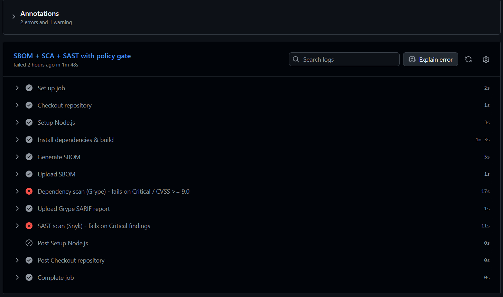*Figure 24. GitHub Actions run for "SBOM + SCA + SAST with policy gate"*

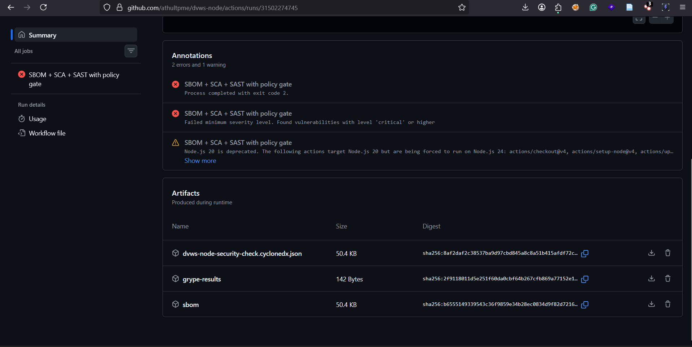*Figure 25. Run annotations report two errors - "Found vulnerabilities with level 'critical'" confirming the Grype gate fired on a Critical finding. The Artifacts panel confirms the SBOM and grype results were published as run outputs.*

This confirms two things about the pipeline's behaviour in practice: first, that the 'severity-cutoff', the Grype step does cause the job to exit non-zero (exit code 2) when a Critical-severity dependency vulnerability is present, rather than only reporting it, and second, that the SBOM and SCA results are correctly published as downloadable artefacts even though jobs as a whole failed, since the 'if: always()' condition on the upload steps ensure evidence is retained regardless of the gate's outcome.

## 8. Mitigation Strategy 

Table 8 consolidates all findings , a single prioritised mitigation plan, indicating the source technique, CVSS score, root cause, recommended mitigation, mitigation type, and remediation priority for each finding.

| Vulnerability | Source | CVSS | Root Cause | Mitigation Strategy | Type | Priority |
|---|---|---|---|---|---|---|
| XXE Injection | DAST + SAST | 9.8 | xmldom 0.8.11 resolves external entities in untrusted XML on the SOAP username service | Upgrade to xmldom 0.8.13, disable external entity resolution in parser configuration, reject DOCTYPE declaration | Component upgrade + configuration hardening | P0 - Immediate |
| vm2 sandbox risk | SCA | 9.0 + | vm2 3.10.3 carries known sandbox-escape CVEs (risk score 146) | Replace vm2 with a maintained alternative (e.g., isolated-vm ) or remove if unused | Component replacement | P0 - Immediate |
| Stored XSS (file upload)| DAST | 7.5 | Uploaded files are served back verbatim, without content-type enforcement or sanitisation | Serve uploaded content with a forced download content, sanitise script-bearing uploads, apply a Content-Security-Policy | Output encoding + upload hardening | P1 - This week|
| Path Traversal | DAST | 7.2 | Download handler concatenates a user-supplied filename into a filesystem path without sanitisation | Canonicalize the resolved path and verify containment within the permitted base directory, apply a filename allow-list | Input validation | P1 - This week |
| Reflected XSS | DAST | 7.1 | Login from input is reflected into the response without encoding | Encode all reflected user input, deploy CSP, set HttpOnly/Secure cookie flags | Output encoding | P1 - This week |
| NoSQL Injection | DAST | 6.5 | The search query is passed to MongoDB without validation or user-scoping, permitting operator and cross-account data leakage | Adopt parameterised queries (e.g., mongo-sanitize), enforce user-scuped query filters server-side | Input validation + access control | P2 - this month |
| Angular legacy CVEs | SCA | 6.1-8.5 | angular 1.8.3 is end-of-life AngularJS with 13 High and 5 Medium known CVEs | Migrate to a supported version, or apply vendor extended-support patches if migration is infeasible short-term | Component upgrade | P2 |

## 9. Conclusion 

This assessment applied a combination od SBOM generation, Software Composition Analysis, Static Application Security Testing, and manual Dynamic Application Security Testing to DVWS-Node, integrating the automatable elements of this workflow into a CI/CD pipeline with an enforced Critical-severity policy gate. The assessment identified  63 SCA findings, 121 SAST findings, and 6 independently confirmed and evidenced DAST findings (plus one, GraphQL introspection, carried forward from prior notes but not re-verified with captured evidence), the most severe of which , a Critical XXE injection vulnerability, was corroborated by two independent assessment techniques.

The result support the broader conclusion that automated, dependency-centric analysis (SBOM/SCA/SAST) and manual, behaviour-centric analysis (DAST) are complementary rather than substitutable: SCA and SAST identified the underlying vulnerable component (xmldom) with precision but could not, by themselves, demonstrate real-world exploitability, whereas DAST confirmed exploitability - with captured request evidence for six of seven findings, but would not, in isolation, have identified the precise vulnerable dependency responsible. their combination therefore produced a more complete and actionable risk picture than either approach alone.

---

## 10. Reference

[1] OWASP Foundation. Available : https://owasp.org/www-project-top-ten/

[2] National Institute of Standards and Technology (NIST). Available: https://www.nist.gov/itl/nvd

[3] OWASP Foundation "CycloneDX Software Bill of Materials Specification". Available : https://cyclonedx.org/tool-center/

[4] Anchore Inc : https://github.com/anchore/grype

[5] Dependency-Track: https://dependencytrack.org/

[6] Snyk: https://docs.snyk.io/

[7] Portswigger : https://portswigger.net/burp/documentation

[8] Dirsearch : https://github.com/maurosoria/dirsearch

[9] DVWS-Node : https://github.com/snoopysecurity/dvws-node

[10] GitHub : https://docs.github.com/en/actions

